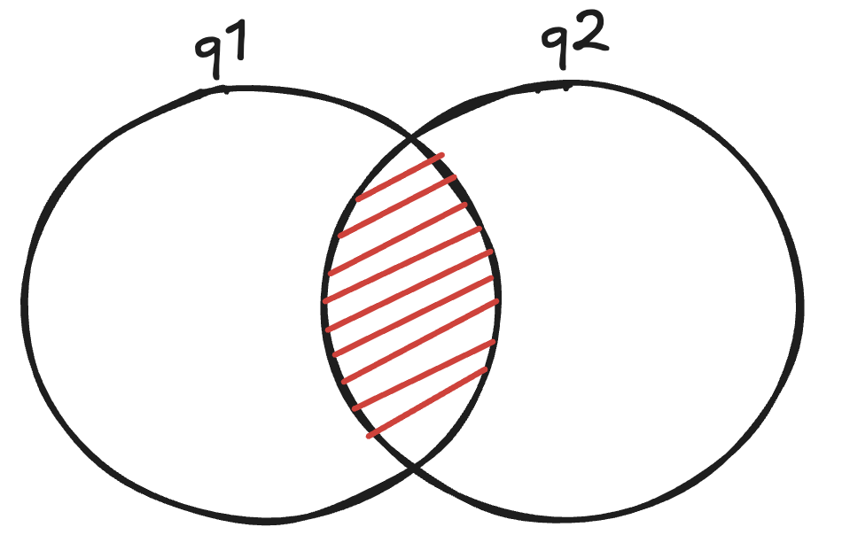

Hello, I have recently started deep diving into a lot of complex consensus designs. In the context of blockchains, Tendermint is widely known, and I had always accepted the `n ≥ 3f + 1` bound without bothering much about its proof. I finally managed to read about it thoroughly, and thought of writing it up to simplify it for others.

The goal of this post is to understand and derive why BFT systems have this bound. We then derive the equivalent bound for CFT systems, and pull out the single argument that produces both.

## Primer

Consensus is the problem of getting multiple replicas — we'll call them validators — to agree on some shared knowledge, such as a sequence of transactions. There are three properties worth knowing:

- **Everyone agrees**: No conflicting blocks.
- **Agreement is on legitimate data**: Validators shouldn't agree on garbage data. The block should be valid.
- **There is an eventual agreement**: The sequence keeps growing rather than stalling forever.

The first two are **safety** properties (nothing bad ever happens) and the third one is **liveness** (something good eventually happens). A safety violation can usually be pinned on someone, which is what slashing is for. A liveness violation usually cannot be: a validator that stays silent looks the same as one whose messages were dropped by the network, which gives it deniability. One should choose what to maximise depending on the use case.

Censorship resistance is also an important property for blockchains, but that's intentionally not discussed here.

Broadly, there are two kinds of faulty behaviour possible:

- **Crashes**: The machines just stop responding and don't participate in consensus. They may come back up later. Protocols that keep working while some of their machines behave this way are called **Crash Fault Tolerant** (CFT).
- **Byzantine**: A validator under an adversary's control. It may do anything: send malformed messages, send nothing, double vote, etc. Voting for two conflicting blocks at the same height is called **equivocation**. Protocols that keep working while some of their machines behave this way are called **Byzantine Fault Tolerant** (BFT).


We won't go too deep into the underlying network assumptions. Most protocols here assume **partial synchrony**: messages eventually arrive, but you don't know when. That's enough to describe them as:

> **Safe always. Live once the network behaves.**

The argument that follows never mentions timing, which is why the safety half holds regardless of what the network is doing.

## The proof of two-thirds for BFT protocols

The setup:
- `n`: total validators participating
- `f`: the number of faulty validators the protocol promises to tolerate (for BFT, they will be Byzantine). Note that `f` is a design parameter, not a count of how many validators are misbehaving right now.

**Goal**: We need to choose a value `q` which denotes the number of votes required before a block can be committed. Two forces pull the value of `q`.

**1. Liveness pushes `q` down.**

In the worst case, all `f` faulty validators stay silent, so we can never count on more than `n − f` votes arriving. Hence, we can't choose a value of `q` greater than `n − f`, as the network would halt.

For example, take `n = 100` and `f = 33`. If we choose `q = 80` and the 33 faulty validators simply go silent, the remaining 67 honest validators can never reach 80 votes, and we would face a network stall.

Hence, the first constraint is:
```
q ≤ n − f
```

**2. Safety pushes `q` up.**

For a safety violation to happen, there must be at least two conflicting commits. For example, a proposer proposes blocks A and B at the same height `h`. For both A and B to be committed, each would need at least `q` votes.

In order to achieve our initial goal, i.e. preventing a safety violation, we need to make two conflicting quorums impossible. In other words, if two sets of `q` validators are disjoint (i.e. there's no validator overlap), a safety violation can happen, as there will be two conflicting blocks at the same height and both would be valid. No validator in either set can be held accountable, as none of them has double voted.

Before we get to the second constraint, a good mental model to develop here is that we need to find a value of `q` which makes the two-conflicting-quorum scenario impossible. In this case, the overlap is a good lever, as the total number of validators is finite.

What happens if we set `q` very low (ignore the faulty validators for now)? Say `n = 100` and `q = 40`. Validators 1–40 vote for block A and validators 41–80 vote for block B. Both collect `q = 40` votes and both commit. No one equivocated here. The safety property still got violated.

Now if we set `q = 51` in the same example, we need two groups of 51 each, which is 102 validators. Because `n = 100` is fixed, at least one validator will have to appear in both groups and vote for A and B for both to be committed.

Note that raising `q` doesn't stop anyone from voting. It forces someone to vote twice. Honest validators wouldn't do this, so only a malicious one would. This intersection is where the contradiction is forced to live. The adversary would prefer the two quorums to be disjoint, and our argument above shows that this isn't possible if `q` is large enough.

**Finding the overlap:**



In the image above,
- `q1` is the set of validators who voted for block A.
- `q2` is the set of validators who voted for block B.

The red section is the overlap.

If we add `|q1| + |q2|`, we double count the overlapping validators. To find the intersection, we can say that:

```
|q1 ∩ q2| = |q1| + |q2| − |q1 ∪ q2|
```

There are only `n` validators in total, so the union can't be larger than `n`. Substituting the largest possible union gives us the smallest possible intersection:
```
|q1 ∩ q2| ≥ q + q − n = 2q − n
```

In other words, we needed `2q` votes for blocks A and B combined, but only `n` distinct validators exist, so anything beyond that was counted twice.

Any other arrangement of the two sets overlaps more than this. `2q − n` is the floor, and a floor is exactly what an argument about adversaries needs, because the adversary gets to pick the arrangement.

For example, if `n = 100` and `q = 67`, two groups of 67 validators add up to 134, and because we only have 100 validators, at least 34 of them must overlap (which is `2q − n`).

**The constraint:**

Now that we have identified some overlapping validators, consider a validator `v` in this set. By definition, `v` voted for both A and B.

If `v` is honest, this is impossible. We can reason about it very simply. A quorum is not a committee that discusses before reaching an agreement, it's just a count of votes. If blocks A and B are both to be committed, each needs at least `q` votes. So even if one honest validator refuses to double vote, one of the two groups will be short of a vote and will never get committed. This is the simplest and most minimal constraint.

Now we bring the faulty actors into the picture. An honest validator would anyway try not to double vote. It's the `f` faulty actors who would equivocate and vote for both A and B. The adversary chooses where its validators vote, so we should assume the worst: all `f` of them sit inside the intersection and vote for both A and B.

If the guaranteed overlap is 34 and `f = 33`, a single honest validator is left over in the intersection, and its refusal to double vote stops one of the two commits. If the overlap were only 30, the faulty validators could fill it entirely, double vote, and both blocks would be committed, contradicting our safety property. Hence, our second constraint is that the overlap must be strictly larger than the total number of faulty validators (liars):

```
2q − n ≥ f + 1
```
which can also be written as
```
q ≥ (n + f + 1)/2
```

**Putting both forces together:**

- Safety: `q ≥ (n + f + 1)/2`
- Liveness: `q ≤ n − f`

This brings us to
```
(n + f + 1) / 2   ≤   n − f
     n + f + 1    ≤   2n − 2f
        3f + 1    ≤   n
```

This is where `n ≥ 3f + 1` comes from. It's not a convention or a definition, but the exact condition under which a quorum size exists that satisfies both requirements.

Coming back to our example, if we have `n = 100` and `f = 33`, safety demands `q ≥ 67` and liveness demands `q ≤ 67`. Hence we choose the only possible value, i.e. 67.

**Practical systems:** So far we have treated `f` as given and solved for `n`. Real systems work the other way round. At any point in time the validator set is fixed and for a given value of `n`, we need to find the smallest quorum `q` that is still safe? In other words, the smaller the quorum `q`, the more faulty validators you can afford (i.e. maximize `f`). This makes the system resilient to worst case scenarios.

The `2/3+1` term is derived as follows:
- We know that `q ≤ n − f`, which gives `f ≤ n − q`, so the largest `f` we can tolerate is `n − q`.
- We substitute this value into the safety constraint.
```
2q − n  ≥  (n − q) + 1
    3q  ≥  2n + 1
     q  ≥  (2n + 1)/3
```

This means `q = ⌊2n/3⌋ + 1`. Given any `n`, this fixes `q`, and the tolerated `f = n − q` follows:

| `n` | `q = ⌊2n/3⌋ + 1` | max `f = n − q` |
|---|---|---|
| 4 | 3 | 1 |
| 5 | 4 | 1 |
| 6 | 5 | 1 |
| 7 | 5 | 2 |
| 100 | 67 | 33 |
| 101 | 68 | 33 |
| 102 | 69 | 33 |
| 103 | 69 | 34 |

Notice that `f` doesn't grow smoothly with `n`. It only moves when `n` crosses the next `3f + 1`. Going from 4 validators to 5 or 6 buys nothing — you still tolerate a single fault, you have only made the quorum bigger. The seventh validator is the one that gets you to two. The same thing happens higher up: validators 101 and 102 add no fault tolerance at all, and only at 103 does it move to 34.

Practical implementations don't really use `f` at all. They just check whether a particular block has more than 2/3 of the total voting power (by stake) behind it.

## The proof for CFT protocols

The same two forces exist in this world, and the same counting works. Only one thing changes.

For CFT protocols, we assume that the `f` faulty validators can never send anything wrong or conflicting. They can only fail by stopping (crashing) and not participating at all. This model is used by algorithms like Raft and Paxos.

The liveness constraint in this case remains the same as that in BFT.
```
q ≤ n − f
```

The safety constraint changes as follows.

In this model, every validator that speaks is trustworthy, so no one ever double votes. The honest/faulty split collapses into a simpler one: present or absent. A validator may vote once, or may not vote at all (in case it has crashed or is disconnected from the rest of the network), but it will never vote twice.

Our argument in BFT was that at least one honest validator must be left over in the intersection once the `f` possible liars are accounted for. In CFT nobody lies, so the requirement is much weaker: we just need the intersection to be non-empty.

If the intersection is empty, nothing stops two groups to commit blocks A and B independently (e.g. in the `n = 100`, `q = 40` case). If the intersection is non-empty, some validator `v` sits in both sets. Because there's no double vote, `v` votes for A and won't vote for B. B ends up one vote short of `q` and it never commits.

So the minimum size of the intersection is just 1, which brings us to the safety constraint:

```
2q − n ≥ 1
```

Combining both as before, `2q − n ≥ 1` can be written as `q ≥ (n + 1)/2`, and:
```
(n + 1) / 2   ≤   n − f
     n + 1    ≤   2n − 2f
    2f + 1    ≤   n
```

This gives us `n ≥ 2f + 1`, a simple majority quorum.

Notice that `2q − n ≥ 1` can also be written as `q > n/2`, which is a simple majority, and `f` doesn't appear at all. The safety floor is fixed by `n` alone, and faulty validators don't contribute to it. They only contribute to liveness.

## Generalizing the argument

Both derivations above followed the same steps. It's worth writing them down, because only one number changed between the two models.

Let `x` be the number of validators that can double vote. In BFT that is `f`, since a Byzantine validator can vote for anything. In CFT it is `0`, since a crashed validator votes once or not at all.

1. Assume a safety property is violated. Blocks A and B are both committed at some height `h`.
2. Then two sets of validators exist: a set `q1` of `q` validators that voted for A, and a set `q2` of `q` validators that voted for B.
3. Check the overlap. Both sets are drawn from the same `n` validators, so the constraint `|q1 ∩ q2| ≥ 2q − n` applies.
4. Check that the overlap is big enough. The safety constraint we imposed gives `2q − n ≥ x + 1`, so the intersection holds at least `x + 1` validators.
5. Find an honest one inside it. At most `x` of them can lie and the intersection holds at least `x + 1`, so at least one honest validator `v` is left.
6. See what validator `v` did. It voted for both blocks A and B, by belonging to both `q1` and `q2`.
7. Apply the model's rule for what an honest validator will do.
8. Conclude. The rule says `v` cannot have done that, so the assumption in step 1 is false, and A and B cannot both commit.

Only steps 4, 5 and 7 depend on the fault model:

| | Crash faults (CFT) | Byzantine faults (BFT) |
|---|---|---|
| `x`, validators that can double vote | `0` | `f` |
| Step 4: intersection must hold at least | 1 validator | `f + 1` validators |
| Step 5: honest validators left over | the single one in the intersection | at least one, after the `f` liars are set aside |
| Step 7: the rule that `v` breaks | a validator votes once, or not at all | an honest validator never equivocates |

Everything else is identical. The whole difference between a simple majority and two-thirds is that a Byzantine model has to buy `f` extra validators' worth of intersection before it can find an honest one inside it. As per step 8, we can say that the safety violation cannot happen.

## Putting both side by side

For a quick comparison, we have
```
CFT: safety  2q − n ≥ 1        liveness  q ≤ n − f
BFT: safety  2q − n ≥ f + 1    liveness  q ≤ n − f
```

In both models, `f` appears the same way in the liveness constraint. But in the safety constraint, `f` only appears in BFT, and the CFT one is independent of `f`. The extra `f` is the price of faulty validators being able to do something rather than just fail.

| | Crash faults only (Raft, Paxos) | Byzantine faults (PBFT, Tendermint) |
|---|---|---|
| What a faulty validator can do | stop, and nothing else | anything, including equivocate |
| Intersection must contain | ≥ 1 validator | ≥ `f + 1` validators |
| Safety constraint | `2q − n ≥ 1` | `2q − n ≥ f + 1` |
| Liveness constraint | `q ≤ n − f` | `q ≤ n − f` |
| Smallest `n` that tolerates `f` | `2f + 1` | `3f + 1` |
| Quorum as a fraction of `n` | `q > n/2` (a simple majority) | `q > 2n/3` (which is `n − f` at `n = 3f + 1`) |

The last row is the same information as the safety constraint, rewritten as a fraction of `n` after substituting the largest `f` each model can tolerate.

---

That's all for now. If you want to discuss this further or have any questions, feel free to reach out (preferably via [X/Twitter](https://x.com/manav24_) or [LinkedIn](https://www.linkedin.com/in/manav-darji/)). Hoping to share some more consensus-related write-ups soon. Thank you for reading.